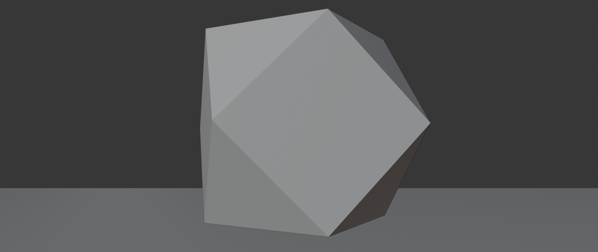
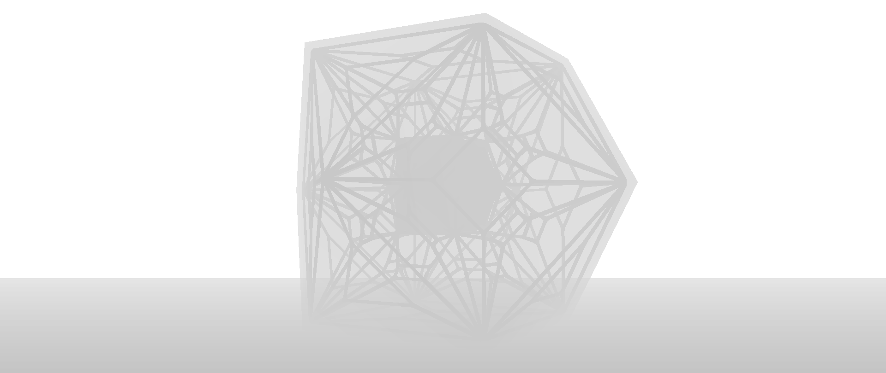

🔬 zGlass

Este addon para Blender permite gerar mapas de profundidade (Depth Maps) mais precisos ao renderizar cenas com vidro. Ele rastrear a profundidade de cada pixel, levando em conta a refração, reflexão e IOR dos materiais de vidro.

Viewport: 
  

Imagem renderizada

Mapa de profundidade do blender

Mapa de profundidade fake feito a partir de dois mapas com e sem o materia de vidro

Mapa de profundidade renderizado pelo zGlass

⚙️ Instalação
Para usar o addon no momento, você precisará carregar o script principal:

    Baixe o arquivo zGlass.py

    No Blender, vá para a aba Scripting (Criação de Scripts).

    Clique em Open (Abrir) e selecione o arquivo zGlass.py.

💡 Como Usar (Passos Atuais)

Como o addon ainda está em desenvolvimento, a configuração dos materiais é feita manualmente antes de rodar o script.

1. Preparando os Materiais de Vidro

Para que o script identifique e trate um objeto como vidro, você precisa adicionar duas Custom Properties a cada objeto de vidro:

    Custom Property 1: Identificação do Tipo

        Selecione o objeto de vidro.

        Vá para a aba Material Properties (o ícone de uma esfera vermelha e cinza).

        Na seção Custom Properties, clique em New.

        Defina o nome como 'render_type'

        Defina o valor como 'Glass'

    Custom Property 2: Definição do IOR

        Na mesma seção, clique em New novamente.

        Defina o nome como 'ior'

        Define-o com o valor do IOR do seu vidro (ex: 1.5 para vidro comum).

2. Rodando o Script

Após configurar todos os materiais de vidro:

    Volte para a aba Scripting.

    Com o script carregado, clique no botão Run Script (icone de Play).
    
    O script irá executar(O blender ficara travado durante todo o tempo que o 
    script estiver rodando) e o resultado estará disponível no painel de rendering, 
    procure por 'Depth Map Render'

🛣️ Próximos Passos

Eu estou trabalhando para simplificar o processo.

O objetivo principal é criar uma interface de usuário que elimine a necessidade de configurar propriedades personalizadas manualmente. Isso incluirá uma nova aba para configurar o addon de forma rápida e intuitiva.

🤝 Contribuições e Feedback

Se você encontrar algum bug ou tiver sugestões de melhorias, por favor, abra uma Issue neste repositório.

📜 Licença

Este projeto está distribuído sob a Licença Pública Geral GNU (GNU GPL) versão 3.0 ou posterior.
